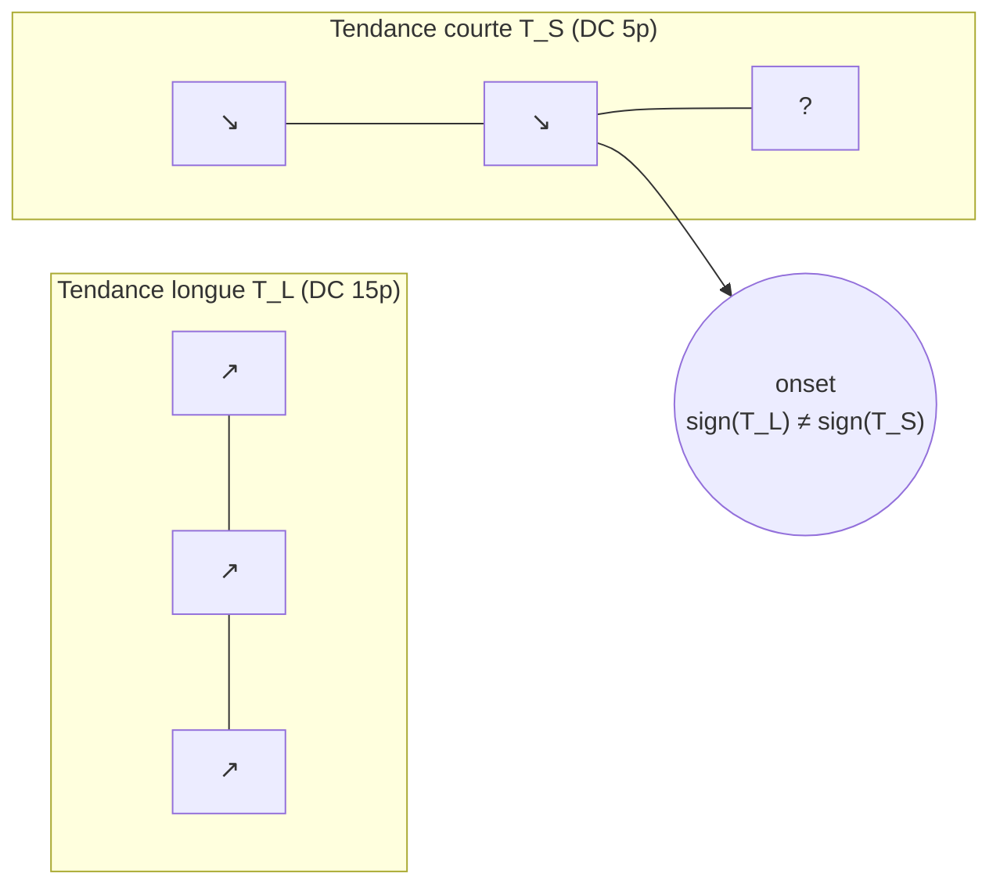
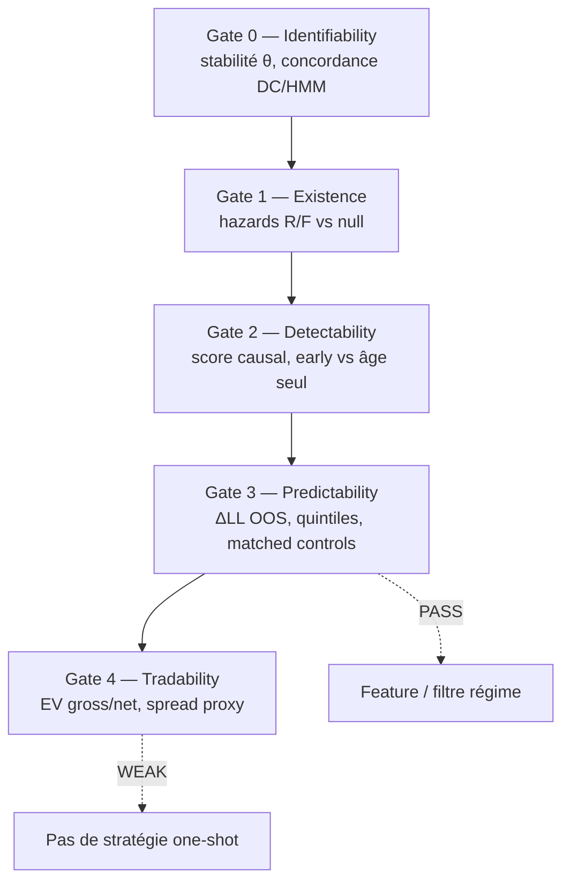

# Pullback multi-échelle : quand le marché « contre-tendance » est un état, pas un trade

Sur EURUSD en barres d'imbalance de ticks, un motif revient souvent : la tendance **courte** diverge de la tendance **longue** — un pullback dans une structure plus large. La question n'est pas seulement « est-ce tradable ? », mais d'abord :

1. Ce processus **existe-t-il** au-delà d'un null ?
2. Peut-on le **détecter** tôt avec des signaux causaux ?
3. Réduit-on l'incertitude sur son **issue** (resume vs fail) ?
4. L'edge **survit-il** aux coûts ?

Cette note suit le framework **gates 0→4** du lab. Résultat principal : **prédictibilité d'état validée OOS**, **tradabilité nette non**.

### Lexique (termes récurrents)

| Terme               | Signification                                                                                                                                         |
| ------------------- | ----------------------------------------------------------------------------------------------------------------------------------------------------- |
| **DC**              | _Directional Change_ — changement de direction déclenché quand le prix reverse d'un seuil \(\delta\) (ici 5p / 15p). Proxy de tendance multi-échelle. |
| **TIMB**            | _Tick Imbalance Bars_ — barres construites sur un nombre fixe d'imbalances de ticks (`tick_imbalance_10_fixed`).                                      |
| **disc / dev**      | Splits temporels 2023 : **disc** = H1 (fit, gel des hyperparamètres) ; **dev** = H2 (**OOS** pour tout ce qui est gelé sur disc).                     |
| **OOS**             | _Out-of-sample_ — évaluation hors période d'ajustement (ici dev vs disc).                                                                             |
| **R / F**           | _Resume_ / _Fail_ — issues d'état du conflit multi-échelle (pas des PnL).                                                                             |
| **competing risks** | Modèle où plusieurs issues mutuellement exclusives se disputent la fin d'un épisode (ici \(R\) vs \(F\)).                                             |
| **ΔLL**             | Gain de log-vraisemblance du modèle avec score vs baseline (âge seul ou contexte vol).                                                                |
| **Gate**            | Étape de validation process-first : existence → detectability → predictability → tradability.                                                         |
| **causal**          | Feature calculée avec information \(\le t\) uniquement (pas de look-ahead).                                                                           |
| **EV net**          | Espérance de gain par trade après coût (spread aller-retour proxy 0.2 pip).                                                                           |
| **MFE / MAE**       | _Maximum Favorable / Adverse Excursion_ — excursion max favorable / défavorable intra-trade.                                                          |
| **null**            | Contrôle statistique (ex. circular-shift des flags) pour tester si la structure dépasse le hasard.                                                    |

---

## Setup

| Paramètre | Valeur                                         |
| --------- | ---------------------------------------------- |
| Actif     | EURUSD                                         |
| Barrière  | `tick_imbalance_10_fixed` (TIMB)               |
| Année     | 2023                                           |
| Split     | **disc** (H1) → fit / gel ; **dev** (H2) → OOS |
| Labels L0 | Amplitude-based Tr8dr (hérité du univers)      |

Les gates 2–4 utilisent uniquement des features **causales** \(X_{\le t}\). Aucun seuil n'est optimisé sur Sharpe ou EV pour valider les gates amont.

---

## Définition du processus

### Onset (conflit multi-échelle)

On note \(T_L\) la direction de la tendance longue (DC \(\delta=15\) pips) et \(T_S\) la direction courte (DC \(\delta=5\) pips). Un épisode **countertrend** démarre à \(t_0\) si :

$$
\mathrm{sign}(T_L(t_0)) = s,\quad \mathrm{sign}(T_S(t_0)) = -s,\quad s \in \{-1,+1\}
$$

avec durée minimale du conflit \(L_{\min} = 3\) bars.



### Issues : competing risks d'état (pas de TP/SL)

Chaque épisode se termine par l'un des événements suivants :

| Issue      | Symbole | Définition                                                                        |
| ---------- | ------- | --------------------------------------------------------------------------------- |
| **Resume** | \(R\)   | \(T_S\) rejoint \(T_L\) — le conflit se résout dans le sens de la tendance longue |
| **Fail**   | \(F\)   | \(T_L\) bascule pendant le conflit — la structure longue est « cassée »           |
| Censure    | \(C\)   | Fin de série ou coupure de split                                                  |

$$
y \in \{R, F, C\}, \qquad p(R \mid R \cup F) \approx 0.79 \text{ (stable disc/dev)}
$$

**Important :** \(R\) et \(F\) sont des **états de structure**, pas des PnL. La tradabilité est testée séparément au Gate 4.

---

## Protocole : cinq gates



| Gate | Question                        | Critère PASS (résumé)                                 |
| ---- | ------------------------------- | ----------------------------------------------------- |
| 0    | La définition est-elle stable ? | Plateau θ ; concordance inter-représentations         |
| 1    | Structure > null ?              | Hazards / taux \(R\mid R\cup F\) rejettent shift-null |
| 2    | Observable tôt ?                | \(\Delta\) vs baseline âge sur dev                    |
| 3    | Incertitude réduite OOS ?       | \(\Delta\mathrm{LL} > 0\) vs contexte vol + contrôles |
| 4    | Edge net > 0 ?                  | EV net après spread                                   |

Détail des critères : [`research_notes/market_processes/SPEC_GATES.md`](../../research_notes/market_processes/SPEC_GATES.md).

---

## Résultats

### Gate 1 — Existence

| Split | \(n\) épisodes | Durée moy. | \(R \mid (R \cup F)\) |
| ----- | -------------- | ---------- | --------------------- |
| disc  | 6 553          | 13.0 bars  | **0.791**             |
| dev   | 4 808          | 13.8 bars  | **0.781**             |

- Ratio dev/disc \(\approx 0.99\) — ordre de grandeur stable.
- Null circular-shift sur les flags de conflit : **rejeté** (\(p \approx 0\)).
- Distribution des issues : **Resume dominant** (~79 %), Fail ~21 %.

**Lecture :** le conflit multi-échelle n'est pas un artefact de permutation ; la question pertinente devient _comment_ il se résout.


---

### Gate 2 — Detectability

Score causal gelé sur **disc** (corrélations avec \(y=R\), pas PnL) :

$$
S_t = w^\top x_t, \quad x_t \in \{\texttt{align16\_now},\ \texttt{recover\_align16},\ \texttt{exc\_against\_long},\ \ldots\}
$$

Poids dominants (disc) : `align16_now` (+0.18), `recover_align16` (+0.10), `exc_against_long` (−0.42).


**Dev (OOS)** — person-period aux âges \(\{1,2,4,8,12,16\}\) :

| Âge | \(p(R)\) base | top 20 % \(p(R)\) | \(\Delta p(R)\) | \(\Delta\)LL score |
| --- | ------------- | ----------------- | --------------- | ------------------ |
| 1   | 0.781         | 0.835             | +0.053          | 24                 |
| 2   | 0.781         | 0.873             | +0.092          | 62                 |
| 4   | 0.780         | 0.920             | +0.140          | 130                |
| 8   | 0.748         | 0.896             | +0.147          | 130                |


- \(\Delta\)LL joint (âge + score) vs âge seul \(\approx 473\) (person-period, dev).
- Gain **modeste à l'onset** (+3–5 pts de hit \(R\)) ; signal **fort intra-épisode** quand les softs HMM se ré-alignent.

**Décision : PASS.** Détectable tôt au sens « discrimination R/F », pas « timer d'exit plus court ».

---

### Gate 3 — Predictability

Target : \(y \in \{R,F\}\) à l'issue de l'épisode (ou à l'âge \(k\) en person-period).

Métrique principale — gain de log-vraisemblance vs contexte vol :

$$
\Delta\mathrm{LL} = \mathrm{LL}(p(y \mid X_{\le t}, \text{vol})) - \mathrm{LL}(p(y \mid \text{vol}))
$$

**Dev (OOS)** :

| Slice | \(\Delta\)LL vs vol | \(\Delta\)LL score vs null | \(n\) |
| ----- | ------------------- | -------------------------- | ----- |
| onset | **+32**             | +22                        | 4 808 |
| âge 4 | **+137**            | +130                       | 4 536 |
| âge 8 | **+143**            | +130                       | 3 307 |


**Quintiles du score** (dev, onset, \(n \approx 962\) / quintile) :

| Quintile  | \(p(R)\)  | Durée moy. |
| --------- | --------- | ---------- |
| Q1 (bas)  | 0.737     | 12.6       |
| Q2        | 0.737     | 13.7       |
| Q3        | 0.809     | 14.5       |
| Q4        | 0.790     | 13.9       |
| Q5 (haut) | **0.835** | 14.0       |


**Contrôles matched** (dev) : \(\mathrm{corr}(S, R) = 0.027\) observé vs \(\approx 0\) sous shift-null ; **\(p = 0.01\)**. Signe \(\Delta\)LL stable disc→dev.


**Décision : PASS.** Le score réduit l'incertitude sur l'issue **au-delà** du contexte de vol et des nulls.

---

### Gate 4 — Tradability

Politique V1 (proxy, **sans** retuner la segmentation DC) :

- Direction : trader **avec** \(T_L\) (fade du pullback).
- Entrée : onset + délai \(d\) si \(S_t \geq C\) (quantile gelé sur disc).
- Sortie : fin d'épisode d'état ou time-cap \(q\).
- Coût : spread aller-retour **0.2 pip**.

Meilleure cellule sur **disc** : \(q=0.8\), \(d=4\), cap \(=32\) bars :

| Métrique      | disc      | dev (même cellule) |
| ------------- | --------- | ------------------ |
| EV net (pips) | **+0.14** | **−0.22**          |
| Hit gross     | 66 %      | —                  |
| MFE moyen     | +2.1 pips | —                  |
| MAE moyen     | −2.9 pips | —                  |


Asymétrie défavorable : mouvement favorable moyen inférieur au drawdown intra-trade. L'edge brut ne survit pas au coût **OOS**.

**Décision : WEAK (FAIL net OOS).** Conforme au flowchart : garder le process comme **feature / filtre de régime**, pas comme stratégie autonome.

---

## Synthèse

| Question                                | Réponse                                                      |
| --------------------------------------- | ------------------------------------------------------------ |
| Le pullback multi-échelle est-il réel ? | Oui — taux \(R\mid R\cup F \approx 79\%\), stable, > null    |
| Peut-on le lire tôt ?                   | Oui — softs HMM + excursion ; gain surtout **intra-épisode** |
| Peut-on prédire R vs F OOS ?            | Oui — \(\Delta\)LL jusqu'à **+137** (âge 4, dev)             |
| Faut-il le trader tel quel ?            | **Non** — EV net OOS **−0.22 pip** sous spread 0.2           |

> Un bon score de **prédictibilité d'état** n'implique pas un edge **exécutable**. Séparer les gates évite de confondre « le marché a une structure » avec « je peux en tirer du PnL ».

**Usage recommandé :** entrée dans un stack de **régime** (permission, hazard, feature pour modèle aval) — pas signal d'entrée isolé.

---

## Banque de figures

Toutes les figures sont dans `assets/multi_scale_countertrend/`. Libellés en anglais. À piocher selon le support (article long, slide, CV).

| Fichier                         | Gate  | Usage suggéré                  |
| ------------------------------- | ----- | ------------------------------ |
| `cumulative_hazard_RF.png`      | 1     | Dynamique competing risks R/F  |
| `stability_disc_dev.png`        | 1 & 3 | Robustesse temporelle disc→dev |
| `score_weights_disc.png`        | 2     | Interprétabilité du score      |
| `detectability_delta_R_dev.png` | 2     | Signal intra-épisode           |
| `onset_delta_hit_dev.png`       | 2     | Lift modeste à l'entrée        |
| `delta_ll_by_age_dev.png`       | 3     | ΔLL croissant avec l'âge       |
| `quintiles_p_resume_dev.png`    | 3     | Calibration du score           |
| `gate4_ev_net_disc_vs_dev.png`  | 4     | Échec OOS (cellule unique)     |
| `gate4_ev_heatmap_q08.png`      | 4     | Pas de zone robuste OOS        |
| `gate4_excursion_profile.png`   | 4     | Asymétrie MFE/MAE              |

Régénération :

```bash
micromamba run -n financial-ml python scripts/research-figures/generate_multi_scale_countertrend_figures.py
```

---

## Reproductibilité

| Artefact     | Chemin                                                                                                           |
| ------------ | ---------------------------------------------------------------------------------------------------------------- |
| Spec process | [`research_notes/.../SPEC.md`](../../research_notes/market_processes/processes/multi_scale_countertrend/SPEC.md) |
| Journaux     | `RESULTATS_GATE01.md` … `RESULTATS_GATE04.md`                                                                    |
| JSON / CSV   | `research_notes/.../out/gate{2,3,4}_*.json`                                                                      |

```bash
cd research_notes/market_processes/processes/multi_scale_countertrend
micromamba run -n financial-ml python run_gate2_detectability.py
micromamba run -n financial-ml python run_gate3_predictability.py
micromamba run -n financial-ml python run_gate4_tradability.py
```

---

_Article dérivé du journal lab — août 2026. Formulation et figures sujettes à révision pour publication site._
