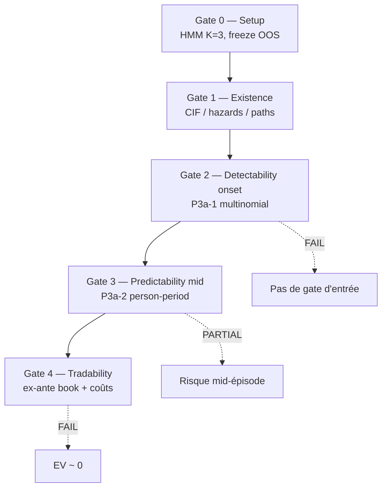

# HMM slope denoising : un contexte de régime, pas un signal d'entrée

La pente OLS t-stat est un indicateur bruyant. Un HMM à trois états (down / neutral / up) peut la **débruiter** sur plusieurs horizons et produire des *soft slopes* causales. La question n'est pas seulement « le filtre est-il sain ? », mais :

1. Existe-t-il une **structure d'épisodes** (doute court vs contre-mouvement) ?
2. Peut-on **filtrer à l'onset** (ex-ante) ?
3. Peut-on prédire l'**issue** mid-épisode ?
4. Un trade soft-fade **survit-il** aux coûts ?

Résultat principal : **CIF R/E/B stable (~28/68/4 %)**, hazard dynamique utile mid-épisode (**AUC E ≈ 0,82**), mais **pas de gate d'entrée** et **EV ≈ 0** OOS.

### Lexique (termes récurrents)

| Terme | Signification |
|-------|----------------|
| **soft slope** | Espérance d'état HMM projetée sur \(\{-1,0,+1\}\) (filtre causal, pas MAP seul). |
| **MAP** | *Maximum a posteriori* — état le plus probable à \(t\). |
| **soft-fade** | Onset : \(s_{16}\) passe de thesis (+1) à 0 alors que \(s_{128}\) reste thesis. |
| **R / E / B** | *Resolve* / *Escalate* / *Break* — issues absorbantes de l'épisode soft-fade. |
| **CIF** | *Cumulative incidence function* — \(F_k(c) = P(\text{cause }c\text{ avant âge }k)\). |
| **cause-specific hazard** | \(\lambda_c(k)\) — taux instantané de sortie pour la cause \(c\) à l'âge \(k\). |
| **person-period** | Une ligne par (épisode, âge) tant que l'épisode est at-risk. |
| **calib window** | Fenêtre de fit HMM (ici **60 jours**) avant freeze des paramètres. |
| **OOS** | *Out-of-sample* — ici année **2024** entière après fit 2023. |
| **TIMB** | *Tick Imbalance Bars* (`tick_imbalance_10_fixed`). |

---

## Setup

| Paramètre | Valeur |
|-----------|--------|
| Actif | EURUSD |
| Barrière | `tick_imbalance_10_fixed` (TIMB) |
| Fit | 60j 2023 → freeze |
| Éval | IS post-calib 2023 + **OOS 2024** |
| Horizons | \(\{16, 32, 64, 128\}\) |
| HMM | C2, \(K=3\), sticky \(E[D]=40\) |

Runtime baseline ≈ **23 s / an** de bars.

---

## Définition

### Soft slope multi-horizon

Pour chaque fenêtre \(w\), le HMM émet sur la t-stat OLS et produit un soft :

$$
s_w(t) \in [-1,1], \qquad \text{causale : filtre } \mathcal{F}_{\le t}
$$

Émissions typiques (w=16) : \(\mu \approx (-5.9,\ 0.1,\ 6.1)\) pour (down, neutre, up).

### Soft-fade onset

Un épisode démarre à \(t_0\) si :

$$
s_{16}(t_0^-)=+1,\quad s_{16}(t_0)=0,\quad s_{128}(t_0)=+1
$$

(et symétrique pour thesis short). Causes absorbantes :

| Issue | Symbole | Définition |
|-------|---------|------------|
| **Resolve** | \(R\) | \(s_{16}\) revient à thesis avant que \(s_{128}\) lâche |
| **Escalate** | \(E\) | \(s_{16}\) passe contre thesis |
| **Break** | \(B\) | \(s_{128}\) abandonne la thesis |

$$
y \in \{R, E, B\}, \qquad \mathrm{CIF}_{K_{\max}} \approx (0.28,\ 0.68,\ 0.04)
$$

---

## Protocole



| Gate | Question | Verdict |
|------|----------|---------|
| 0 | Filtre sain / stable ? | **PASS** |
| 1 | Structure d'épisodes ? | **PASS** |
| 2 | Filtre à l'onset ? | **FAIL** |
| 3 | Prédiction mid-épisode ? | **PARTIAL** |
| 4 | Edge exécutable ? | **FAIL** |

---

## Résultats

### Gate 0 — Setup


- États lisibles, stickiness dominée par les émissions.
- Freeze 2023-H1 → soft 2024 : corr **0.955–0.996** selon l'horizon.

**Décision : PASS.**

---

### Gate 1 — Existence


| Set | \(n\) | CIF \(R\) | CIF \(E\) | CIF \(B\) |
|-----|------:|----------:|----------:|----------:|
| IS | 4 429 | 0.280 | 0.687 | 0.034 |
| OOS | 4 366 | 0.281 | 0.681 | 0.038 |

- \(\bar\lambda_E\) ages 1–4 ≈ **0.12** ; \(\bar\lambda_R\) ages 9–12 ≈ **0.09** — E précoce, R plus tard.
- Doute court : ~**90 %** ré-alignement *parmi* \(R\cup B\) (≠ proba de l'onset).
- Contre-mouvement : ~**60 %** ré-alignement.

**Décision : PASS.** Structure stable IS≈OOS.

---

### Gate 2 — Detectability (onset only, P3a-1)

Features softs à \(t_0\) uniquement → multinomial \(R/E/B\).

| Métrique OOS | Valeur |
|--------------|-------:|
| log-loss | 0.741 |
| AUC E-vs-rest | **0.522** |
| AUC R-vs-rest | 0.510 |


Courbes `safety = 1 − P̂(E)` : **pas de monotonie OOS**.

**Décision : FAIL.** Pas de gate d'entrée sur la géométrie soft seule.

---

### Gate 3 — Predictability (dynamique, P3a-2)

Person-period \(\{stay, R, E, B\}\) avec features causales en début d'intervalle.

| Métrique OOS | Valeur |
|--------------|-------:|
| log-loss | 0.388 |
| AUC E-vs-rest | **0.816** |


- Discrimination forte pour \(k>1\) ; à \(k=1\) (info onset) : **pas de gate** (monotonie KO).
- Utile comme **modèle de risque en cours d'épisode**, pas comme filtre one-shot.

**Décision : PARTIAL.**

---

### Gate 4 — Tradability

Politique ex-ante : entrer au soft-fade, sortir sur R/E/B.


| Set | mean pips @0 coût | @0.2 pip RT |
|-----|------------------:|------------:|
| IS | −0.03 | −0.23 |
| OOS | −0.01 | −0.21 |

Par issue (IS+OOS agrégé) : resolve **~+4.3 pips**, escalate **~−1.8**, break ~0 — l'escalate (~68 %) tue le book.

**Décision : FAIL.** Pas d'edge standalone.

---

## Synthèse

| Question | Réponse |
|----------|---------|
| Le dénoiseur HMM est-il sain ? | Oui — rapide, états lisibles, freeze stable |
| La structure soft-fade existe-t-elle ? | Oui — CIF **28/68/4** IS≈OOS |
| Peut-on filtrer à l'onset ? | **Non** — AUC E ≈ 0.52 |
| Peut-on lire le risque mid-épisode ? | **Oui** — AUC E ≈ 0.82 (person-period) |
| Faut-il trader le soft-fade tel quel ? | **Non** — EV ≈ 0 / négatif après coûts |

> Le **~90 % de ré-alignement** n'est pas \(P(\text{onset})\). C'est un taux conditionnel parmi \(R\cup B\), alors que ~68 % des trades **escaladent**.

**Usage recommandé :** softs multi-échelle comme **features de régime / hazard mid-épisode** — pas signal d'entrée isolé.

---

## Banque de figures

| Fichier | Gate | Usage suggéré |
|---------|------|----------------|
| `emission_means_by_horizon.png` | 0 | Lisibilité du HMM |
| `frozen_vs_refit_correlation.png` | 0 | Stabilité freeze OOS |
| `align_soft_histogram.png` | 1 | Alignement multi-horizon |
| `cif_by_age_IS_OOS.png` | 1 | Existence / stabilité CIF |
| `cause_specific_hazards.png` | 1 | E précoce vs R tardif |
| `episode_outcome_tree.png` | 1 | Caveat 90 % vs book |
| `onset_safety_quantiles.png` | 2 | Échec gate d'entrée |
| `dynamic_hazard_auc_by_age.png` | 3 | Prédictibilité mid-épisode |
| `pnl_by_exit_type.png` | 4 | Asymétrie R vs E |

```bash
micromamba run -n financial-ml python scripts/research-figures/generate_hmm_slope_denoise_figures.py
```

---

## Reproductibilité

| Artefact | Chemin |
|----------|--------|
| Spec | [`research_notes/hmm_slope_denoise/SPEC_HMM2_SLOPE.md`](../../research_notes/hmm_slope_denoise/SPEC_HMM2_SLOPE.md) |
| Journaux | `RESULTATS_HMM2.md`, `RESULTATS_P0–P2.md`, `RESULTATS_SOFT_FADE_SURVIVAL.md`, `RESULTATS_OOS_SOFT_FADE.md` |
| JSON / parquet | `research_notes/hmm_slope_denoise/out/hmm2_*` |

```bash
cd research_notes/hmm_slope_denoise
micromamba run -n financial-ml python run_soft_fade_survival.py
micromamba run -n financial-ml python run_soft_fade_hazard_p3a1.py
micromamba run -n financial-ml python run_soft_fade_hazard_p3a2.py
```

---

*Article dérivé du journal lab — août 2026. Formulation et figures sujettes à révision pour publication site.*
