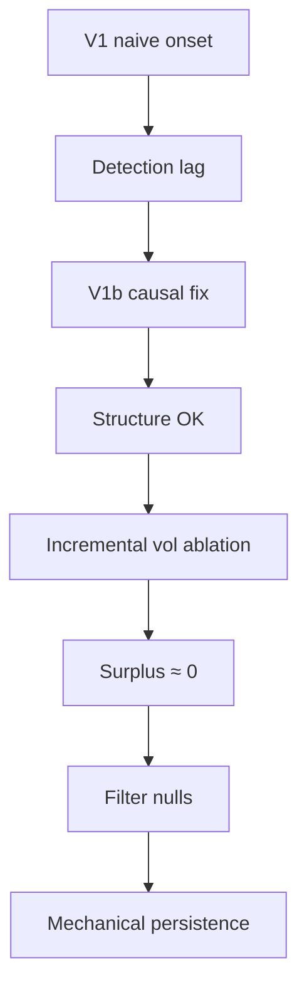

# Compression → expansion : quand le « régime de vol » n'ajoute rien

On voit souvent une compression de volatilité suivie d'une expansion. La question méthodo :

1. L'onset V1 capture-t-il vraiment une **compression** (ou un déplacement déjà engagé) ?
2. Un matching plus causal (**V1b**) restaure-t-il une structure propre ?
3. La vol ajoute-t-elle de l'**information incrémentale** vs slope + efficiency ratio ?
4. La persistance d'un z-score rolling est-elle un **régime**, ou un artefact de filtre ?

Réponse courte : V1 était **laggé** ; V1b corrige la structure ; le **surplus vol ≈ 0** ; la persistance z est **mécanique**.

### Lexique

| Terme | Signification |
|-------|----------------|
| **`std_logp`** | Détecteur d'onset sur écart-type log-prix (quantile haut). |
| **event-centered τ** | Alignement des séries autour de l'onset (\(\tau=0\)). |
| **\(D_k^\pm\)** | Déplacement médian \(k\) bars avant (−) / après (+) l'onset. |
| **\(N_A/N_B/N_C\)** | Nulls de matching croissants : TOD → +compression → +\(D_{\mathrm{pre}}\). |
| **V1b** | Reformulation early+causal (moins de clustering, \(D^-\) réduit). |
| **incremental ablation** | Δ métrique base+vol − base (slope/ER). |
| **mechanical persistence** | ACF d'un z rolling ≈ null IID-RW reconstruit de la même façon. |
| **TIMB** | *Tick Imbalance Bars*. |

---

## Setup

| Paramètre | Valeur |
|-----------|--------|
| Actif / barrière | EURUSD · TIMB 2023 |
| Détecteurs | `std_logp`, `std_ret` |
| Cadre | \(E\) (sampler) → \(X\) (features) → \(Y\) (outcome) |

---

## Arc narratif



---

## Résultats

### 1 — V1 : escape déjà haut au null


À H=10 : \(P(\mathrm{escape})\) event **0.89** vs null **0.86** — Δ cosmétique. Pas de preuve exploitable pour cette définition d'onset.

### 2 — Diagnostic : detection lag


AUCΔ **pré-onset ≈ 39** vs **post ≈ 6** : le détecteur réagit surtout à un déplacement **déjà engagé**. Matching sans contrôler \(V_{\mathrm{long}}\) / \(D_{\mathrm{pre}}\) trompe.


Sous \(N_C\) (compression + \(D_{\mathrm{pre}}\)) : Δ MFE\(_{50}\) H=10 ≈ **+0.06** seulement.

### 3 — V1b : structure corrigée


| Métrique | V1 | V1b |
|----------|---:|----:|
| \(n\) events | 3 068 | 1 697 |
| \(D_5^-\) | 2.24 | **1.50** |
| Frac gaps < 40 | 57 % | **5 %** |
| Median gap | 26 | **152** |

Early+causal OK — mais ce n'est pas encore de l'edge.

### 4 — Ablation incrémentale : surplus vol ≈ 0


Base = compression % + \(D_{\mathrm{pre}}\) + |slope| + ER. Ajouter des features vol :

| Δ métrique | Valeur |
|------------|-------:|
| Δ log-loss | **−0.001** |
| Δ Brier | ≈ 0 |
| Δ R² | ≈ 0 |

`std_logp` = **contexte / maturité**, pas trigger autonome.

### 5 — Filter null : persistance mécanique


Excès ACF(z,1) vs null IID-RW ≈ **+0.004** — quasi nul. Les détecteurs Δv / slope ont un fort recall mais aussi un fort FA rate ; le niveau est tardif.

---

## Synthèse

| Question | Réponse |
|----------|---------|
| V1 prouve-t-il compression→expansion ? | **Non** — lag + null déjà saturé |
| V1b sauve-t-il la structure ? | **Oui** — moins de clustering, \(D^-\) plus propre |
| La vol ajoute-t-elle de l'info ? | **Non** — surplus ≈ 0 vs slope+ER |
| La persistance z est-elle un régime ? | **Non** — artefact du filtre rolling |

> On a cru voir un process de vol ; le diagnostic montre un **détecteur retardé**, puis une **structure corrigée sans edge incrémental**.

**Usage recommandé :** features de contexte (maturité / activité), pas onset trading autonome.

---

## Banque de figures

| Fichier | Usage suggéré |
|---------|----------------|
| `v1_escape_scoreboard.png` | Scoreboard V1 non informatif |
| `event_centered_std_logp.png` | Detection lag |
| `ablation_matching_mfe.png` | Nulls \(N_A\to N_C\) |
| `v1_vs_v1b_profiles.png` | Fix structurel |
| `gap_clustering_frac.png` | Déclustering V1b |
| `incremental_ablation_bars.png` | Punchline surplus ≈ 0 |
| `acf_z_vs_iid_null.png` | Persistance mécanique |
| `onset_benchmark_recall_delay.png` | Trade-off recall / FA |

```bash
micromamba run -n financial-ml python scripts/research-figures/generate_compression_expansion_figures.py
```

---

## Reproductibilité

| Artefact | Chemin |
|----------|--------|
| PLAN / README | [`research_notes/compression_expansion/`](../../research_notes/compression_expansion/) |
| Journaux | `RESULTATS_V1*.md`, `RESULTATS_FILTER_NULL.md` |
| JSON | `out/v1_*.json`, `out/v1b_*.json`, `out/filter_null_onset_2023.json` |

---

*Article dérivé du journal lab — août 2026.*
