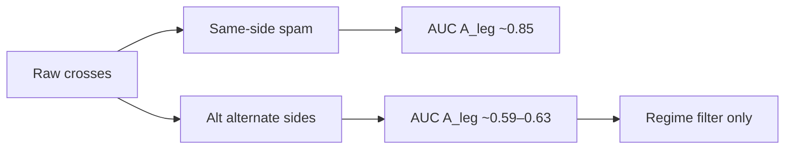

# Stochastic events : quand l'AUC 0,85 est un artefact de sampling

Un croisement stochastique (%K) est un candidat naturel d'event. Sur l'univers **raw** (tous les croisements), les modèles C/A affichent des AUC séduisantes — jusqu'à **A_leg ≈ 0,85**. La leçon du lab :

> **Le sampling est la métrique.** Compter le spam same-side dans une jambe Tr8dr gonfle l'AUC sans créer d'edge d'entrée.

Sur l'univers **alt** (côtés alternés, events tradables) : A_leg tombe à **~0,59–0,63**, C_event reste ~**0,62** — filtre de régime faible, pas stratégie.

### Lexique

| Terme | Signification |
|-------|----------------|
| **stoch band** | Seuils %K (ex. 10/90 ou 20/80) sur période \(p\in\{16,32\}\). |
| **raw universe** | Tous les croisements %K — inclut spam same-side dans une jambe. |
| **alt_overlap** | Events avec `alternate_sides=True` ; overlaps de trades autorisés. |
| **alt_no_overlap** | Alt + trade-sim swing RR1 (TP/SL, time-cap 128). |
| **C_event** | Tâche : contexte / permission autour de l'event. |
| **A_leg / A_fwd** | Tâches directionnelles : jambe Tr8dr / forward return. |
| **same-side spam** | Multiples croisements dans le même sens pendant une tendance. |
| **ΔLL** | Gain de log-vraisemblance vs prior (base rate). |
| **TIMB** | *Tick Imbalance Bars*. |

---

## Setup

| Paramètre | Valeur |
|-----------|--------|
| Actif / barrière | EURUSD · TIMB 2023 |
| Split | train H1 / valid H2 |
| Univers focus | `stoch_32_10_90` (comparaisons raw/alt) |
| Features | C : range/slope/TOD ; A : slope FFD + OFI |

---

## Définition

Un event stochastique à \(t\) : %K\((p)\) croise une bande \([\ell, h]\).

$$
e_t = \mathbf{1}\{\%K_p(t)\ \text{crosses}\ \{\ell,h\}\}
$$

Trois univers de scoring :

| Mode | \(n\) (`stoch_32_10_90`) | Rôle |
|------|-------------------------:|------|
| raw | 35 040 | Archive (biaisé) |
| alt_overlap | 7 279 | Référence lab |
| alt_no_overlap | 3 736 | Trade-sim swing |

---

## Protocole



---

## Résultats

### 1 — Sampling bias


Passer raw → alt divise \(n\) par ~5 et retire les re-hits dans la même jambe.

### 2 — AUC raw vs alt


Focus `stoch_32_10_90` :

| Mode | C_event | A_leg | A_fwd |
|------|--------:|------:|------:|
| raw | **0.70** | **0.85** | 0.79 |
| alt_overlap | 0.63 | **0.59** | 0.54 |
| alt_no_overlap | 0.62 | **0.63** | 0.60 |

L'anti-overlap remonte un peu A (moins de re-hits) mais reste loin du raw.

### 3 — Paramètres stoch & univarié


Sur alt, period **16** garde un A plus fort (~0.70–0.75) que period 32 — toujours dans la zone « filtre », pas « edge ».

### 4 — Gain d'information


ΔLL sur alt est **modeste** ; C_event ~0.62 = permission/régime faible.

---

## Synthèse

| Question | Réponse |
|----------|---------|
| L'AUC 0,85 raw est-elle un edge ? | **Non** — artefact de spam same-side |
| Que reste-t-il sur alt ? | C_event ~0.62 ; A_leg ~0.59–0.63 |
| Usage recommandé | **Filtre de régime / permission**, pas exécution |

> Toujours scorer sur l'univers **tradable**. Sinon le modèle apprend la corrélation répliquée de la tendance, pas une décision d'entrée.

---

## Banque de figures

| Fichier | Usage suggéré |
|---------|----------------|
| `sampling_bias_schematic.png` | Punchline méthodo |
| `event_counts_by_universe.png` | Coût du filtrage alt |
| `auc_raw_vs_alt.png` | Chute A_leg 0.85→0.59 |
| `auc_by_stoch_params.png` | Sensibilité période/bande |
| `univariate_c_event_features.png` | Drivers C_event |
| `delta_ll_vs_prior.png` | Info incrémentale faible |
| `multi_task_summary_bars.png` | Vue d'ensemble alt |

```bash
micromamba run -n financial-ml python scripts/research-figures/generate_stoch_event_context_figures.py
```

---

## Reproductibilité

| Artefact | Chemin |
|----------|--------|
| Journal référence | [`RESULTATS_STOCH_ALT.md`](../../research_notes/stoch_event_context/RESULTATS_STOCH_ALT.md) |
| Archive raw | `out/raw_v1/` |
| Alt | `out/alt_overlap/`, `out/alt_no_overlap/` |

```bash
cd research_notes/stoch_event_context
micromamba run -n financial-ml python run_materialize_stoch_pops_alt.py
```

---

*Article dérivé du journal lab — août 2026.*
